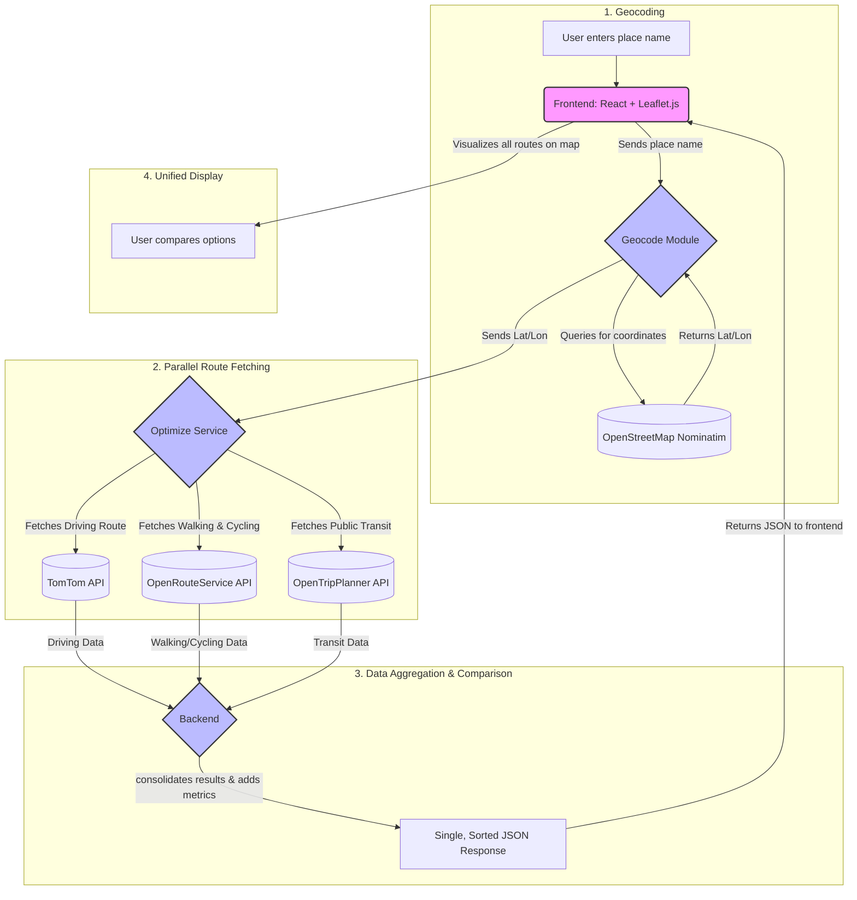

# Path Optimizer  

          

**Making Sustainable Commutes Simple, Fast, and Affordable for Every Student.**

---

## Introduction  

Every day, millions of college students face the same problem: getting from home to campus efficiently, affordably, and sustainably. The lack of intelligent, student-centric commute tools means that most end up choosing either costly private vehicles or struggling with public transportation systems that feel confusing and unreliable. This daily grind translates into wasted study hours, drained wallets, and higher-than-necessary environmental impact.  

**Path Optimizer** was created to change this. Our platform isn’t just another navigation app — it’s a **purpose-built solution for the student commuter experience.** By combining real-time transit data, optimized routing, and clear comparisons across multiple modes of transport, Path Optimizer equips students with the information they need to make smarter travel choices instantly.  

Unlike general navigation tools, Path Optimizer:  
- Focuses on **student priorities**: balancing speed, cost, and sustainability  
- Offers **multi-modal transparency**: side-by-side comparisons of buses, shuttles, cycling, walking, and private vehicles  
- Provides **data-rich insights**: cost per km, CO₂ impact, and time efficiency for every option  
- Encourages a **culture of sustainability** by showing students the tangible benefits of eco-friendly choices  

At its core, Path Optimizer is about **empowerment**. It empowers students to:  
- Reclaim valuable time that would otherwise be lost in inefficient commutes  
- Stretch limited budgets by highlighting the most affordable routes  
- Contribute to a greener future, one commute at a time  

We believe commuting should never be a barrier to education, nor should it come at the cost of the environment. With Path Optimizer, sustainable commuting becomes not just the right choice — but the easiest and smartest one.  

---

## The Challenge: The Student Commute Grind  
For thousands of college students, the daily commute is a significant source of stress and inefficiency.  
- **No intelligent transit tools** → reliance on costly private vehicles or confusing bus routes  
- **Lost time & money** → wasted study hours and tight student budgets strained further  
- **High carbon footprint** → sustainability sacrificed for convenience  

---

## Our Solution: Smart, Sustainable Travel  
**Path Optimizer** is a web application designed to empower student commuters with real-time, intelligent route decisions.  

### Key Features  
- **Instant Route Comparison**  
  Students input start and end points to get optimized routes based on speed or affordability.  

- **Multi-Modal Analysis**  
  Compare public transport with driving, cycling, or walking in one unified interface.  

- **Data-Driven Decisions**  
  Metrics like travel time, fuel cost, and estimated CO₂ emissions provided for every option.  

---

## The Green Impact: Measurable and Meaningful  
Optimizing routes encourages a shift away from cars, directly reducing emissions.  

- **Per Student Impact:** Switching from a car to a bus can save **~1.5–2 kg CO₂ per week**  
- **Campus Impact:** A culture of sustainability built through smarter commuting choices  

### Standardized Metrics  

| Metric                  | Value      | Assumption / Source |
|--------------------------|-----------:|----------------------|
| CO₂ Emissions (Car)     | 121.9 g/km | Passenger car avg. |
| CO₂ Emissions (E-Bike)  | 14 g/km    | Life-cycle emissions |
| CO₂ Emissions (Cycle)   | 16 g/km    | Life-cycle emissions |
| CO₂ Emissions (Walk)    | 5 g/km     | Life-cycle emissions |
| Fuel Cost (Car)         | ₹6.67/km   | ₹100/L fuel & 15 km/L mileage (Oct 2025) |

---

## Vision for Growth: Smarter Campuses & Cities  

- **City-Wide Expansion**  
  Ready for deployment in cities with GTFS (General Transit Feed Specification) data (e.g., Delhi, Mumbai).  

- **Institutional Integration**  
  Universities can integrate with shuttle services, cutting costs and improving student experience.  

- **Smart City Applications**  
  Can power dashboards for campuses, CSR initiatives, and municipal mobility planning.  

---

## Summary  
Path Optimizer is more than just a commute planner. It’s a sustainability-focused mobility platform built to:  
- Save **time & money** for students  
- Reduce **carbon emissions**  
- Scale towards **smarter campuses & cities**  

---

## Technical Foundation  

Our solution is built on a **robust, scalable, and open-source technology stack**, designed for reliability and easy deployment. We are planning every component to be containerized with **Docker** to ensure consistent performance across environments.  

### Technology Stack  

| Component       | Technology / Service |
|-----------------|-----------------------|
| **Frontend**    | React, Leaflet.js |
| **Backend**     | Flask (Python) |
| **Geocoding API** | OpenStreetMap Nominatim |
| **Routing APIs** | TomTom API, OpenRouteService API, OpenTripPlanner API |
| **Transit Data** | GTFS (General Transit Feed Specification) |
| **Deployment**  | Docker |

---

## How It Works  

Path Optimizer employs a **multi-API strategy** to deliver the most accurate and relevant route data for each transport mode. The system processes every user request through a well-defined data pipeline:

1. **Geocoding**  
   - User enters a place name (e.g., *“Main Library”*).  
   - **Geocode module** queries **OpenStreetMap Nominatim** → returns latitude & longitude.  

2. **Parallel Route Fetching**  
   - **Optimize service** sends concurrent API calls:  
     - **TomTom API** → Driving routes  
     - **OpenRouteService (ORS) API** → Walking & Cycling routes  
     - **OpenTripPlanner (OTP) API** → Public Transit (via GTFS data)  

3. **Data Aggregation & Comparison**  
   - Backend consolidates results  
   - Adds key metrics: travel time, cost, CO₂ emissions  
   - Returns a **single, sorted JSON response**  

4. **Unified Display**  
   - **React + Leaflet.js frontend** visualizes routes on an interactive map  
   - Students compare options (fastest vs. cheapest) instantly  

---

## 🔗 System Architecture Diagram  


---

This modular, API-driven architecture ensures that Path Optimizer is not only **scalable across campuses and cities**, but also **adaptable** as new transport data sources and routing technologies emerge.  
## Installation  

To get the project running locally, please follow these steps.  

### Prerequisites  
- **Python 3.8+**  
- **Node.js v16+**  
- **An active internet connection** (for external API access)  

---

### 🛠 Setup Instructions  

```bash
# 1. Clone the repository
git clone https://github.com/aryanhgit/path-optimizer.git
cd path-optimizer

# 2. Set up the backend (in the /backend directory)
cd backend

# Create and activate a Python virtual environment
python3 -m venv .venv
source .venv/bin/activate   # On Linux/macOS
# .\.venv\Scripts\activate  # On Windows

# Install backend dependencies
pip install -r requirements.txt

# 3. Set up the frontend (in the /client directory)
cd ../client

# Install frontend dependencies
npm install

# 4. Run the application
# In one terminal (from /server), start the backend:
flask run

# In a second terminal (from /client), start the frontend:
npm start
```

---

## Configuration

To access routing and geocoding services, you’ll need API keys, if the API keys are expired.

1. **TomTom API** (for driving routes)

   * Sign up at [TomTom Developer Portal](https://developer.tomtom.com/)
   * Get your API key
   * Add it to your backend configuration file (e.g., `config.py` or `.env`):

     ```bash
     TOMTOM_API_KEY=your_tomtom_api_key
     ```

2. **OpenRouteService (ORS) API** (for walking & cycling)

   * Sign up at [OpenRouteService](https://openrouteservice.org/sign-up/)
   * Get your API key
   * Add it to your config:

     ```bash
     ORS_API_KEY=your_openrouteservice_api_key
     ```

3. **OpenTripPlanner (OTP)** (for public transit with GTFS)

   * Download or generate **GTFS data** for your city/campus
   * Configure OTP server to read GTFS data
   * Update backend config with OTP server URL:

     ```bash
     OTP_API_URL=http://localhost:8080/otp/routers/default
     ```

4. **OpenStreetMap Nominatim** (for geocoding)

   * Public instance available at: `https://nominatim.openstreetmap.org`
   * For heavy usage, you can self-host Nominatim.

Make sure to restart your backend after updating `.env` or `config.py`.

---

## Usage

Once the application is running, navigate to it in your browser.

1. **Log in** with the provided credentials or create a new account.

   * Username: `harry`
   * Password: `123harry`

**Sign Up Page**


**Sign In Page**


2. Click on **"Find Route"** in the navigation bar.

3. In the form, enter your **starting location** and **destination**.

4. Select your optimization priority:

   * **Fastest** (time-optimized route)
   * **Cheapest** (cost-optimized route)

5. Click **"Compare Routes."**

6. A **comparison table** will appear, showing:

   * Mode of Transport
   * Distance (km)
   * Time (min)
   * Estimated CO₂ Emissions
   * Fuel Cost

7. After reviewing, click **"View Map"** on your preferred route to see the path visualized on the interactive map.

---

## Example Output

**Route Page**


**Comparison Table**


**Map View**


## Sustainability Dashboard  

Path Optimizer goes beyond route optimization by helping users **track and improve their environmental impact**. The platform includes a **personalized dashboard** and community-driven features to make sustainable commuting engaging and rewarding.  

### **Your Green Footprint**  
A personal analytics hub where users can monitor their impact:  
- **Total CO₂ Saved** – The cumulative emissions reduced by choosing greener travel modes.  
- **Best Streak** – Longest consecutive days of eco-friendly commuting.  
- **Weekly Activity Log** – Detailed breakdown of each trip’s CO₂ savings.  
- **Visual Progress Charts** – See travel modes used and track CO₂ savings over the last 30 days.


### **Campus Champions**  
Encourages a **collective effort** by displaying campus-wide statistics:  
- Total CO₂ saved by all users  
- Total number of green trips taken  


### **Eco-Champions Leaderboard**  
Gamifies sustainable travel to **motivate friendly competition**:  
- Ranks users based on their CO₂ savings  
- Rewards consistent eco-friendly behavior with recognition and leaderboard visibility  


By combining **personal analytics**, **community goals**, and **friendly competition**, Path Optimizer makes sustainable commuting:  
- **Engaging** – Users see the impact of their choices.  
- **Measurable** – CO₂ savings are tracked and visualized.  
- **Rewarding** – Leaderboards and streaks motivate consistent green behavior.  

---

### Example Dashboard Visuals  

- Personalized CO₂ footprint and streak tracking  
- Weekly activity logs and travel mode breakdowns  
- Campus-wide leaderboard and eco-champions rankings  

This functionality encourages students to **choose greener commute options more frequently**, transforming sustainability into a **fun, competitive, and tangible experience**.  

## Contributing  

This is an open-source project, and contributions are highly encouraged!  
If you'd like to improve Path Optimizer, follow these steps:  

1. **Fork** the repository  
2. **Create a branch** for your feature or bug fix  
   ```bash
   git checkout -b feature/your-feature-name
   ```
3. **Commit your changes** with clear messages
4. **Push** your branch to your fork
5. **Open a Pull Request** describing your contribution

We recommend checking out issues tagged with **`good first issue`** for beginner-friendly contributions.

---

## Support

If you encounter any issues, bugs, or have feature requests:
Please open an issue here: [GitHub Issues](https://github.com/aryanhgit/path-optimizer/issues)

---

## Acknowledgments

Special thanks to the **open-source community** and the teams behind:

* **OpenStreetMap** for geocoding data
* **TomTom, OpenRouteService, OpenTripPlanner** for routing APIs
* **Leaflet.js** for interactive mapping
* **GTFS** for making transit data accessible

---
